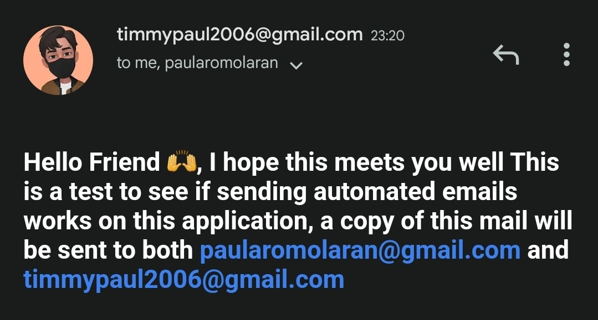

## 📧 Email Sender

### sending automated emails in a nodejs application

Useful in handling:

- verification emails
- newsletters

#### RESOURCES

[Nodemailer Implementation](https://www.freecodecamp.org/news/use-nodemailer-to-send-emails-from-your-node-js-server/)
